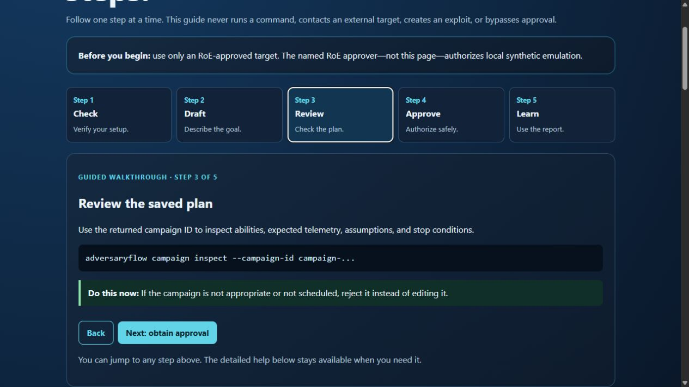

# AdversaryFlow

AdversaryFlow is a safety-first purple-team platform for turning current threat-intelligence into reviewable, scoped, defensive campaign simulations.

Licensed under the [Apache License 2.0](LICENSE). See the [installation guide](docs/INSTALL.md), [CLI reference](docs/CLI_REFERENCE.md), [usage guide](docs/USAGE.md), and [security policy](SECURITY.md).

Supported platforms are Windows, Debian, Ubuntu, and Kali Linux. Supported environments are validated by `adversaryflow doctor`; unsupported platforms fail closed with a remediation message.

## MVP

The first vertical slice provides:

- A machine-readable Rules of Engagement (RoE) file.
- Hard target allowlist enforcement and denylist support.
- Mandatory dry-run planning.
- Human approval records for campaign execution.
- Audit events with redacted inputs and SHA-256 evidence references.
- MITRE ATT&CK STIX ingestion from the official public repository.
- Campaign plans that pair each technique with expected telemetry and validation questions.
- A provider-neutral AI review prompt that keeps planning defensive and novice-friendly.
- Versioned, safe emulation abilities with telemetry expectations, cleanup contracts, and deterministic plan hashes.

The MVP deliberately does not generate exploit payloads, persistence, credential theft, evasion, lateral movement commands, or unrestricted network actions. Execution adapters are simulation-only and must be extended behind the safety interfaces.

AI provider integration is intentionally left behind a small adapter boundary so an organization can choose its approved model, data-handling policy, and retention settings.

The `draft` command uses a deterministic offline fallback. A hosted or local model can implement the `AIPlanner` interface, receive `build_ai_request_prompt(...)`, return `AICampaignDraft`, and then pass through `validate_ai_draft(...)` before any emulation plan is created.

## IDPT-inspired capabilities

AdversaryFlow adopts the reference project's useful control-plane patterns: immutable ability metadata, fixed scenario planning, explicit technique and platform fields, telemetry as a first-class output, cleanup contracts, run-root evidence, and deterministic plan provenance. The initial catalog only permits abstract simulation actions, no arbitrary commands, no remote execution, and no non-loopback network scope.

## Quick start

```powershell
python -m venv .venv
.\.venv\Scripts\Activate.ps1
pip install -e ".[dev]"
adversaryflow validate examples\roe.yaml
adversaryflow plan --roe examples\roe.yaml --actor "APT29" --technique T1059.001
adversaryflow draft --roe examples\roe.yaml --actor "APT29" --objective "validate endpoint process visibility"
adversaryflow demo --roe examples\roe.yaml --actor "APT29" --objective "validate endpoint process visibility"
adversaryflow doctor
adversaryflow support-bundle
adversaryflow capabilities
adversaryflow campaign --actor "APT29" --objective "validate endpoint process visibility"
adversaryflow manager --open
adversaryflow guide --interactive
```

Use `--live` only in a future approved adapter; the current release always produces a dry-run plan.

The local workflow includes an ephemeral loopback sink bound to `127.0.0.1` only. It accepts a fixed synthetic marker, records the request for telemetry validation, and shuts down when the run completes. No external network connection is used.

See [docs/INSTALL.md](docs/INSTALL.md) for Windows, Linux/Kali, and Docker setup. `doctor` is the first troubleshooting command, and `support-bundle` creates a redacted diagnostics archive.

Maintainers can use the [release checklist](docs/RELEASE_CHECKLIST.md) before creating a release tag.

## Downloads

Versioned unsigned release artifacts are published at the [GitHub Releases page](https://github.com/rikterskale/AdversaryFlow/releases). Each release includes a wheel, source distribution, source ZIP, SHA-256 manifest, and CycloneDX SBOM. GPG signing is intentionally not enabled in this development release.

## AI provider management

Offline mode is the default and requires no credentials. To inspect or validate provider configuration:

```powershell
adversaryflow provider status
adversaryflow provider configure
adversaryflow provider validate
adversaryflow provider profile status
```

The supported hosted configuration is an OpenAI-compatible endpoint using `ADVERSARYFLOW_PROVIDER`, `ADVERSARYFLOW_ENDPOINT`, `ADVERSARYFLOW_MODEL`, and `ADVERSARYFLOW_API_KEY`. The API key is read from the process environment only; it is never written to project files or support bundles. Validation is non-networked.

After configuring a provider, explicitly test one harmless planning request:

```powershell
adversaryflow provider test
```

This is the only provider command that sends a network request. It sends a planning prompt and ability catalog, never an execution command or target data.

Provider profiles store non-secret endpoint and model settings. After selecting a profile, `adversaryflow provider profile status` reports whether its required credential environment variable is available and gives the exact safe next step; it never displays the credential value.

## Unified campaign workflow

Create a provider-backed or offline draft without executing anything:

```powershell
adversaryflow campaign --actor "APT29" --objective "validate endpoint process visibility"
```

After review, the approver named in the RoE can authorize the safe local emulation:

```powershell
adversaryflow campaign --actor "APT29" --objective "validate endpoint process visibility" --approve --approver "manager@example.test"
```

Campaign drafts are persisted under `artifacts/campaigns/`. The command returns a campaign ID so approval can resume the exact reviewed draft:

```powershell
adversaryflow campaign --campaign-id campaign-... --approve --approver "manager@example.test"
```

Resuming verifies the saved draft, plan hash, RoE, and ability catalog before emulation; it does not regenerate the AI response.

Completed campaigns also produce `campaign-report.md` and `campaign-report.html` containing the scope, approval, plan hash, behavior result, telemetry counts, and detection gaps. Provider metadata stores hashes, timing, model, and status only; API keys and raw prompts/responses are not persisted.

## Guided local campaign workspace

Run `adversaryflow manager --open` to launch a loopback-only browser workspace. Start with the five-step walkthrough at the top; select any step to see one clear command, explanation, and next action at a time. The workspace can run the allowlisted, local `doctor` health check and display its result. It also generates copyable draft commands, lists locally saved campaigns, and provides context-sensitive help. It does not provide an arbitrary command runner or expose any non-loopback service; approval and emulation remain explicit CLI operations gated by the RoE.



The same step-by-step guidance is available in the terminal with `adversaryflow guide`. Add `--interactive` to enter a threat actor, approved target, and defensive objective; it only generates a copyable draft command and never runs a campaign.

Campaign lifecycle commands:

```powershell
adversaryflow campaign list
adversaryflow campaign inspect --campaign-id campaign-...
adversaryflow campaign reject --campaign-id campaign-... --approver manager@example.test --reason "Not scheduled"
adversaryflow campaign reset --campaign-id campaign-... --confirm
```

`list` and `inspect` are read-only. `reject` preserves an auditable decision. `reset` requires explicit confirmation and only operates inside the configured campaign root.

## Release artifacts

Release builds produce a wheel, source distribution, source ZIP, `SHA256SUMS.json`, and `sbom.cdx.json`:

```powershell
python -m pip install build
python scripts/release.py
```

The release script verifies artifact hashes after building. A clean install should run `adversaryflow doctor --json` and `adversaryflow demo` before release publication.

CI security gates include branch/line coverage, Bandit, pip-audit, Gitleaks, workflow security analysis, and SBOM validation. The test suite currently measures 100% line and branch coverage; release readiness remains separately enforced through clean-install journeys.

Run the clean artifact journey locally after building:

```powershell
python scripts/artifact_journey.py artifacts/release
```

This creates fresh virtual environments for the wheel, source distribution, and source ZIP, then runs doctor, the offline demo, report discovery, and support-bundle generation for each artifact.

## Product direction

The intended workflow is: source-backed intelligence → novice-friendly campaign plan → manager review → scoped simulation → telemetry capture → gap report and retest plan.
