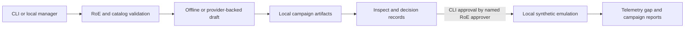

# Architecture

AdversaryFlow separates planning, safety validation, local simulation, lifecycle persistence, and user guidance.

`manager.py` exposes a loopback-only HTTP workspace. `provider.py` validates offline and OpenAI-compatible configuration; `profiles.py` persists non-secret profile metadata. `workflow.py` persists drafts, verifies integrity, enforces approval, and runs the synthetic harness. `emulation.py` permits only `none` and `loopback` network scope. `reports.py` writes Markdown and HTML campaign reports.

The browser does not approve or execute campaigns. Campaign roots and IDs are constrained so lifecycle operations remain within the configured local root.

See the module guides for [campaign workflow](modules/campaign-workflow.md), [local manager](modules/local-manager.md), [providers](modules/providers.md), [diagnostics](modules/diagnostics-and-support.md), [reports](modules/reports.md), and [safety/emulation](modules/safety-and-emulation.md).
