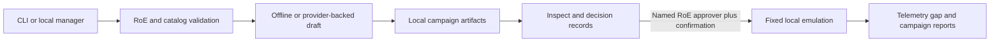

# Architecture

AdversaryFlow separates planning, safety validation, local simulation, lifecycle persistence, and user guidance.

`manager.py` exposes a loopback-only HTTP workspace. `provider.py` validates offline and OpenAI-compatible configuration; `profiles.py` persists non-secret profile metadata. `workflow.py` persists drafts, verifies integrity, enforces approval, and runs the synthetic harness. `emulation.py` permits only `none` and `loopback` network scope. `reports.py` writes Markdown and HTML campaign reports.

The extended local workflows remain behind the manager boundary. `actor_profiles.py` stores and runs profiles that reference only registered benign fixtures or procedures. `benign_procedures.py` creates run-owned evidence and bounded cleanup. `ctid.py` creates and assesses synthetic CTID-fixture bundles. `telemetry.py` normalizes offline vendor exports, performs sensor preflight, and correlates observations. `detection_mappings.py` exports validation templates; `coverage.py` builds the actor-to-detection dashboard; `retest.py` creates immutable gap-derived drafts. `product_tools.py` provides archive search, tags, owner/retention metadata, executive summaries, and validated RoE history.

These components do not add a new execution boundary: they remain local, use fixed or synthetic inputs, and do not provide arbitrary commands, remote execution, external network contact, or production-service changes.

## IDPT adapter boundary

The optional `idpt-local` path adds a second local executor behind the same reviewed campaign boundary:

```mermaid
flowchart LR
  Campaign[AdversaryFlow campaign draft] --> Approval[RoE approval and plan integrity]
  Approval --> Preflight[Adapter preflight]
  Preflight --> Registry[Reviewed IDPT scenario registry]
  Registry --> Checkout[Exact clean IDPT checkout]
  Checkout --> Plan[IDPT plan]
  Plan --> DerivedRoE[Derived IDPT RoE]
  DerivedRoE --> Run[Fixed local IDPT scenario]
  Run --> Verify[IDPT evidence verification]
  Verify --> Events[AdversaryFlow normalized events]
  Events --> Reports[Reports and later telemetry assessment]
```

`idpt_registry.py` ensures that the selected ability set resolves to exactly one reviewed scenario. `idpt.py` validates the checkout, requests the plan, checks plan identity and mappings, creates the derived IDPT RoE, runs the scenario, verifies the evidence manifest, and translates results. The external checkout never receives operator-supplied commands or a campaign-selected scenario.

IDPT behavior evidence is not the same as production telemetry or detection. Those are imported and assessed separately through the telemetry workflow.

The browser manager can approve and run only the fixed `local-synthetic` adapter after exact RoE-approver identity, campaign-specific typed confirmation, and integrity checks. `local-behavioral` and `idpt-local` execution remain CLI paths. Campaign roots and IDs are constrained so lifecycle operations remain within the configured local root.

See the module guides for [campaign workflow](modules/campaign-workflow.md), [local manager](modules/local-manager.md), [providers](modules/providers.md), [diagnostics](modules/diagnostics-and-support.md), [reports](modules/reports.md), and [safety/emulation](modules/safety-and-emulation.md).
