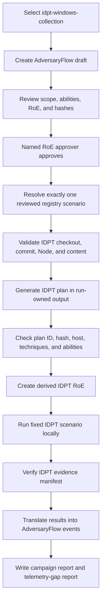

# IDPT local integration

The `idpt-local` adapter delegates one reviewed Windows collection scenario to IDPT Emulation and imports its verified evidence. AdversaryFlow remains the campaign orchestrator and approval system; IDPT remains the typed local executor and evidence producer.

## Trust boundary

The adapter accepts no command, script, scenario, ability ID, commit, or network destination from a campaign. A packaged reviewed-scenario registry selects a scenario only when the approved ability set exactly matches one registry entry. The currently shipped entry is IDPT scenario `scenario--windows-safe-collection-flow` at reviewed commit `dcdac0f3e82469a95975a170bc201b06e164b7b6` and content version `2.0.0`; additional scenarios require an explicit reviewed registry entry.

Before Node.js is invoked, AdversaryFlow verifies:

1. `ADVERSARYFLOW_IDPT_ROOT` contains `src/cli.mjs`.
2. Git `HEAD` equals the reviewed commit.
3. No tracked IDPT file is modified.
4. IDPT's own `validate` command accepts its content manifest.
5. The generated plan contains exactly the five mapped abilities, expected techniques, approved host, and fixed scenario.
6. IDPT's evidence verifier accepts the completed run.

Untracked IDPT output is permitted because IDPT writes run artifacts beneath its checkout by default. The integration itself always supplies an AdversaryFlow run-owned output directory.

## Setup

```powershell
git clone https://github.com/rikterskale/IDPT-Emulation.git C:\Tools\IDPT-Emulation
git -C C:\Tools\IDPT-Emulation checkout dcdac0f3e82469a95975a170bc201b06e164b7b6
$env:ADVERSARYFLOW_IDPT_ROOT = "C:\Tools\IDPT-Emulation"
adversaryflow adapter status --name idpt-local --catalog idpt-windows-collection
```

Node.js 20 or newer and Git must be available on `PATH`.

## Run the reviewed scenario

Create the draft first:

```powershell
adversaryflow campaign --actor "IDPT Windows Collection Baseline" --platform windows --catalog idpt-windows-collection --objective "validate benign collection telemetry"
```

Review the returned ability set and campaign ID. Then resume the exact draft with the RoE-named approver:

```powershell
adversaryflow campaign --campaign-id campaign-... --catalog idpt-windows-collection --approve --approver manager@example.test --adapter idpt-local
```

AdversaryFlow creates a short-lived derived IDPT RoE bound to the generated IDPT plan ID, canonical SHA-256, host, scenario, technique set, and existing AdversaryFlow approval ID. The IDPT checkout and all nested output remain local.

## Evidence and telemetry

The AdversaryFlow run contains `work/idpt/integration.json`, the generated host inventory and derived IDPT RoE, IDPT plan exports, `run.json`, per-action evidence, HTML report, and evidence manifest. Imported AdversaryFlow events retain both identifier sets.

IDPT behavior success is imported independently from telemetry. AdversaryFlow initially reports telemetry as not configured. Use `campaign assess --telemetry-file` with AdversaryFlow run, host, and ability IDs after exporting matching EDR/SIEM observations.

Remote dispatch, arbitrary IDPT scenarios, arbitrary commands, dirty checkouts, unreviewed commits, and production endpoints are not supported.

## What IDPT does in this project

IDPT is not a second campaign manager inside AdversaryFlow. It is the local execution and evidence-producing component used by the `idpt-local` adapter.

AdversaryFlow remains responsible for:

- reading and validating the Rules of Engagement (RoE);
- creating and persisting the reviewed campaign draft;
- selecting the packaged IDPT catalog and reviewed scenario;
- calculating and checking campaign and plan hashes;
- obtaining the named RoE approver's approval;
- creating the AdversaryFlow run directory;
- deciding which adapter may receive the reviewed request; and
- translating verified IDPT results into AdversaryFlow events and reports.

IDPT is responsible for:

- validating its own content and runtime;
- turning the one reviewed scenario into an IDPT plan;
- executing that plan against the local approved host;
- producing its run summary and evidence files; and
- verifying the integrity of its evidence manifest.

The integration does not import commands from the catalog. The catalog supplies a reviewed mapping between AdversaryFlow ability IDs and the corresponding fixed IDPT ability IDs. The packaged registry must resolve exactly one reviewed scenario for the complete selected ability set.

## End-to-end lifecycle

The following is the complete path from a draft to imported evidence:



If any validation step fails, the adapter stops. It does not substitute another scenario, fall back to `local-synthetic`, or execute a partially matching plan.

### Step 1: Choose the reviewed catalog

The `idpt-windows-collection` catalog is a packaged catalog. It identifies the exact five-ability set that the reviewed registry entry permits. A campaign using another catalog cannot be sent to `idpt-local` merely because its technique names look similar.

Inspect readiness first:

```powershell
adversaryflow adapter status --name idpt-local --catalog idpt-windows-collection
```

The readiness result includes the selected IDPT commit, content version, scenario, registry entry, checkout path, and Node version when the checkout is ready.

### Step 2: Create and review the AdversaryFlow draft

Create a draft without execution:

```powershell
adversaryflow campaign --actor "IDPT Windows Collection Baseline" --platform windows --catalog idpt-windows-collection --objective "validate benign collection telemetry"
```

Review the returned campaign ID, target, objective, selected abilities, expected telemetry, stop conditions, plan hash, RoE, and catalog. Approval is still required even though the scenario is fixed.

### Step 3: Validate the external checkout

Before JavaScript is invoked, AdversaryFlow checks all of the following:

1. `ADVERSARYFLOW_IDPT_ROOT` names a directory containing `src/cli.mjs`.
2. `git` and Node.js are available.
3. Node.js is version 20 or newer.
4. `HEAD` equals the reviewed commit.
5. No tracked IDPT file is modified.
6. IDPT's `validate` command reports valid content version `2.0.0`.

The checkout may contain untracked IDPT run output, but tracked-file modifications fail closed.

### Step 4: Build and verify the IDPT plan

AdversaryFlow gives IDPT a generated local host inventory and asks IDPT to plan the one registry-selected scenario. The returned plan must:

- be inside the AdversaryFlow run-owned output directory;
- contain a valid IDPT plan ID;
- match its canonical SHA-256 hash;
- use the expected scenario;
- contain exactly the reviewed external ability IDs;
- preserve the reviewed technique mapping; and
- target the approved AdversaryFlow host.

### Step 5: Bind IDPT to the AdversaryFlow approval

AdversaryFlow creates a short-lived derived IDPT RoE. It contains the AdversaryFlow approval reference, approved operator identity, approved host, allowed IDPT plan ID, allowed plan hash, scenario, technique set, and the parent AdversaryFlow plan hash.

This derived RoE prevents the external executor from treating a different plan, host, scenario, or approval as equivalent.

### Step 6: Run and verify evidence

IDPT runs only after the derived RoE is written. AdversaryFlow then verifies the returned run identity, run directory, status, result ability IDs, and evidence manifest. Evidence is accepted only when IDPT reports `integrity-verified`.

The imported event keeps both identity systems: the AdversaryFlow run/ability IDs and the IDPT run/plan/ability IDs. This makes the result traceable without claiming that behavior success proves telemetry or detection success.

## Artifact map

For an AdversaryFlow run rooted at `artifacts/runs/RUN_ID`, IDPT integration artifacts are stored beneath:

| Artifact | Purpose |
|---|---|
| `work/idpt/hosts.json` | Generated local host inventory supplied to IDPT. |
| `work/idpt/roe.json` | Derived, time-bounded IDPT RoE bound to the approved plan. |
| `work/idpt/output/` | Run-owned IDPT plan and execution output. |
| `work/idpt/integration.json` | Commit, content, registry, scenario, plan, run, mapping, and evidence-hash provenance. |
| IDPT `plan.json` | The fixed scenario plan returned by IDPT. |
| IDPT `run.json` | IDPT run identity, status, and per-action results. |
| IDPT `evidence-manifest.json` | Evidence integrity input whose SHA-256 is recorded by AdversaryFlow. |
| AdversaryFlow `events.jsonl` | Normalized events containing both AdversaryFlow and IDPT identifiers. |

## How to interpret results

There are separate outcomes:

- **Behavior success** means the IDPT action reported a behavior-passed status.
- **Evidence verification** means the IDPT evidence manifest passed integrity verification.
- **Telemetry observation** means matching EDR/SIEM records were later supplied to AdversaryFlow.
- **Detection** means the supplied telemetry contained a detection result.
- **Cleanup** is reported from the IDPT action result and remains distinct from detection.

An IDPT run can therefore have verified evidence while telemetry is `not-configured`, or can have behavior failure while still producing a valid diagnostic run record. Use `campaign assess --telemetry-file` only after exporting matching offline observations.

## Common failure messages

| Failure | Meaning | Safe recovery |
|---|---|---|
| `ADVERSARYFLOW_IDPT_ROOT must name the reviewed IDPT checkout` | The environment variable is missing. | Set it to the local IDPT checkout. |
| `does not contain src/cli.mjs` | The path is not an IDPT checkout with the expected CLI. | Correct the path. |
| `requires git and Node.js 20 or newer` | A required local tool is absent or too old. | Install or expose the required tool, then rerun readiness. |
| `must be pinned to reviewed commit ...` | The checkout is at another commit. | Check out the reviewed commit shown by the guide. |
| `has modified tracked files` | The checkout is not clean. | Restore tracked files or use a fresh checkout. |
| `requires one complete packaged reviewed IDPT scenario catalog` | The selected abilities do not exactly match the registry entry. | Use `idpt-windows-collection` and create a new matching draft. |
| `plan identity ... invalid` or `mapping drifted` | IDPT returned a plan that differs from the reviewed mapping. | Do not approve or retry with the same draft; inspect the checkout and create a new reviewed draft if needed. |
| `integrity-verified` was not reported | IDPT evidence was not trusted by the integration. | Treat the run as failed and do not use its evidence as verified. |
